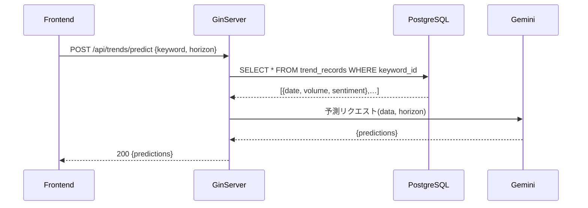

## 0. システム概要

TrendScout はファッション業界向けのトレンド予測＆分析 Web サービス。SNS（Twitter, Instagram）や主要ファッション系 Web サイトからリアルタイムにデータを収集し、AI（Gemini）による自然言語解析・センチメント分析、さらに時系列予測モデルを通じて、以下の機能を提供する。

トレンドモニタリング：ブランド名やスタイルキーワードごとに、投稿数（検索ボリューム）やユーザー反応数の推移を可視化。

センチメント分析：ポジティブ／ニュートラル／ネガティブの比率を算出し、消費者感情の動向を把握。

未来予測：過去データをもとに、Gemini API を用いて指定期間先（horizon）のトレンド指標を予測。

キーワード管理：ユーザーが関心あるキーワードを登録・編集し、ダッシュボードに即反映。

詳細分析：特定日時の投稿サンプルや画像メタデータを確認し、トレンドの背景を深掘り。

主な利用シーン

マーケティング担当者：新コレクションの企画段階で、消費者のリアルタイム反応を確認。

バイヤー／バイイング部門：今後の仕入れトレンドを予測し、在庫戦略を最適化。

コンテンツ制作者：SNS キャンペーンや広告素材のテーマ選定に活用。

対象ユーザー

ファッションブランドのマーケター、リサーチャー

EC サイト運営者、トレンドキュレーター

コンサルティング会社のアナリスト

提供価値

迅速な意思決定支援：ダッシュボード上に集約されたデータで、会議やレポート作成を効率化。

データドリブンな企画立案：感情分析や予測結果をもとに、次のキャンペーンやプロモーションの方向性を提示。

競合との差別化：独自スクレイピングと AI 分析によるトレンド洞察で、他社に先駆けた動きを実現。

- フロントエンド：React (Vite) + TypeScript + Chart.js
- バックエンド：Go + Gin + Redis/JWT
- データ取得：Go (Colly/Rod) → PostgreSQL + MongoDB
- データ分析・予測：Gemini API

---

## 1. 機能要件

### 1.1 会員管理

- **UC1-1: ユーザー登録**

  - 入力：メール、パスワード、確認パスワード
  - バリデーション：メール形式チェック、パスワード強度チェック、一意性チェック
  - 出力：201 + `{ id, email }` / 400 + エラー詳細

- **UC1-2: ログイン**

  - 入力：メール、パスワード
  - 処理：認証成功 →JWT アクセストークン（15 分）＋リフレッシュトークン（7 日）発行、Redis 保存
  - 出力：200 + `{ access_token, refresh_token }` / 401

- **UC1-3: トークンリフレッシュ**

  - 入力：refresh_token
  - 処理：Redis 検証 → 新アクセストークン発行
  - 出力：200 + `{ access_token }` / 401

- **UC1-4: ログアウト**

  - 入力：access_token
  - 処理：Redis から該当トークン削除
  - 出力：200 OK

### 1.2 キーワード管理

- **UC2-1: キーワード登録**

  - 入力：keyword 文字列
  - 処理：ユーザー重複チェック →PostgreSQL に INSERT
  - 出力：201 + `{ id, keyword }` / 400

- **UC2-2: キーワード一覧取得**

  - 入力：なし
  - 処理：ユーザー ID で登録キーワード一覧を取得
  - 出力：200 + `[{ id, keyword, created_at }]`

- **UC2-3: キーワード更新/削除**

  - 入力：キーワード ID ＋更新内容 or DELETE
  - 処理：存在チェック →UPDATE or DELETE
  - 出力：200 OK / 404

### 1.3 ダッシュボード閲覧

- **UC3-1: 過去データ取得**

  - 入力：`?q=keyword&from=YYYY-MM-DD&to=YYYY-MM-DD`
  - 処理：Redis キャッシュ確認 →PostgreSQL から TrendRecords 取得
  - 出力：200 + `[{ date, volume, sentiment }]`

- **UC3-2: 未来予測取得**

  - 入力：`{ keyword, horizon:int }`
  - 処理：TrendRecords→Gemini API 呼び出し → 予測結果取得
  - 出力：200 + `{ predictions:[{ date, value }] }`

- **UC3-3: センチメント詳細取得**

  - 入力：`{ keyword, date }`
  - 処理：MongoDB から該当日の投稿取得 →Gemini 再解析
  - 出力：200 + `{ positive, neutral, negative }`

### 1.4 バックエンド API 構成

- **API アーキテクチャ**

  - **REST API** として提供
  - **MVC（Model–View–Controller）構造** で実装

    - **Model**：DB 操作やビジネスロジック（PostgreSQL/MongoDB のクエリ、Gemini 呼び出しなど）
    - **Controller**：Gin のルーティング定義とリクエストバリデーション、認証チェック
    - **View**：Controller から受け取ったデータをクライアント向け JSON フォーマットに整形して返却

---

## 2. 非機能要件

1. **パフォーマンス**

   - API 応答時間 < 500ms（キャッシュヒット時）
   - スクレイピングバッチ完了 ≤ 30 分

2. **可用性／信頼性**

   - 稼働率 99.9％
   - 自動フェイルオーバー
   - 障害時は Sentry で通知

3. **スケーラビリティ**

   - コンテナ水平スケール（Kubernetes 想定）
   - DB リードレプリカ／シャーディング対応

4. **セキュリティ**

   - HTTPS 強制
   - JWT ＋ Redis による認証管理
   - CORS／CSRF 対策
   - スクレイピング時の robots.txt 遵守・レート制限

5. **運用性**

   - Prometheus ＋ Grafana でログ・メトリクス収集
   - CI/CD（GitHub Actions）
   - ブルーグリーン／カナリアリリース対応

6. **保守性**

   - モジュール疎結合設計
   - OpenAPI(Swagger)で API 定義管理
   - 単体テスト・E2E テスト導入

---

## 3. システム構成概要

```
[User Browser]
     ↓ HTTPS
[React (Vite) Frontend]
     ↓ REST API
[Go + Gin API Server]
 ├─ AuthService       (JWT/Redis)
 ├─ Scraper           (Colly/Rod→PostgreSQL/MongoDB)
 └─ TrendService      (DB→Gemini解析・予測)
     ↓
┌────────────────────────┐
│ PostgreSQL             │
│ ├─ users               │
│ ├─ auth_tokens         │
│ ├─ keywords            │
│ └─ trend_records       │
└────────────────────────┘
     ↓
┌────────────────────────┐
│ MongoDB                │
│ └─ images              │
└────────────────────────┘
     ↓
┌────────────────────────┐
│ Redis                  │
│ └─ JWTトークン管理     │
└────────────────────────┘
```

---

## 4. 外部設計

### 4.1 画面設計

| 画面名           | コンポーネント                     | 入力／表示項目                   | 遷移先               |
| ---------------- | ---------------------------------- | -------------------------------- | -------------------- |
| ログイン         | メール／パスワードフォーム         | バリデーションエラー表示         | ダッシュボード／登録 |
| ユーザー登録     | メール／パスワード／確認パスワード | 強度メーター                     | ログイン             |
| ダッシュボード   | キーワード検索、グラフパネル       | 日付範囲選択、horizon スライダー | 詳細分析             |
| 詳細分析         | 投稿一覧テーブル、円グラフ         | ページング、ソート               | ダッシュボード       |
| プロフィール編集 | 名前、パスワード変更               | OAuth 連携ボタン                 | ダッシュボード       |

### 4.2 API 設計

| URI                   | Method | リクエスト                             | レスポンス                          | エラー例 |
| --------------------- | ------ | -------------------------------------- | ----------------------------------- | -------- |
| /api/auth/register    | POST   | `{email, password, password_confirm}`  | `201 {id, email}`                   | 400/409  |
| /api/auth/login       | POST   | `{email, password}`                    | `200 {access_token, refresh_token}` | 401      |
| /api/auth/logout      | POST   | ヘッダーに Bearer token                | `200 OK`                            | 401      |
| /api/auth/refresh     | POST   | `{refresh_token}`                      | `200 {access_token}`                | 401      |
| /api/keywords         | GET    | 헤ッダー                               | `200 [{id, keyword}]`               | 401      |
| /api/keywords         | POST   | `{keyword}`                            | `201 {id, keyword}`                 | 400/409  |
| /api/keywords/{id}    | PUT    | `{keyword}`                            | `200 OK`                            | 400/404  |
| /api/keywords/{id}    | DELETE | —                                      | `200 OK`                            | 404      |
| /api/trends           | GET    | `?q=xxx&from=YYYY-MM-DD&to=YYYY-MM-DD` | `200 [{date, volume, sentiment}]`   | 400/404  |
| /api/trends/predict   | POST   | `{keyword, horizon}`                   | `200 {predictions:[{date,value}]}`  | 400      |
| /api/trends/sentiment | POST   | `{keyword, date}`                      | `200 {positive, neutral, negative}` | 400      |

---

## 5. バッチ／ジョブ設計

| ジョブ名        | トリガー   | 処理内容                                                  | 再試行 | 監視                |
| --------------- | ---------- | --------------------------------------------------------- | ------ | ------------------- |
| ScrapeJob       | 毎時 0 分  | SNS／サイトクロール →PostgreSQL ＋ MongoDB に保存         | 3 回   | Sentry              |
| TrendAnalyzeJob | 毎時 5 分  | 新規レコードを Gemini 解析 →PostgreSQL にセンチメント更新 | 3 回   | Prometheus アラート |
| PredictJob      | 日次 01:00 | 過去 30 日データで Gemini 予測 →PostgreSQL に保存         | 3 回   | Prometheus          |

---

## 6. 内部設計

### 6.1 シーケンス図（未来予測取得）



### 6.2 DB スキーマ（PostgreSQL）

```sql
CREATE TABLE users (
  id SERIAL PRIMARY KEY,
  email VARCHAR(255) UNIQUE NOT NULL,
  password_hash VARCHAR(255) NOT NULL,
  created_at TIMESTAMP DEFAULT NOW()
);

CREATE TABLE auth_tokens (
  token_id UUID PRIMARY KEY,
  user_id INT REFERENCES users(id),
  expires_at TIMESTAMP NOT NULL
);

CREATE INDEX idx_auth_user ON auth_tokens(user_id);

CREATE TABLE keywords (
  id SERIAL PRIMARY KEY,
  user_id INT REFERENCES users(id),
  keyword VARCHAR(100) NOT NULL,
  created_at TIMESTAMP DEFAULT NOW(),
  UNIQUE(user_id, keyword)
);

CREATE TABLE trend_records (
  id BIGSERIAL PRIMARY KEY,
  keyword_id INT REFERENCES keywords(id),
  record_date DATE NOT NULL,
  volume INT NOT NULL,
  sentiment FLOAT NOT NULL,
  created_at TIMESTAMP DEFAULT NOW(),
  UNIQUE(keyword_id, record_date)
);
```

#### MongoDB （images コレクション）

```json
{
  "_id": ObjectId,
  "keyword_id": ObjectId,
  "image_url": "https://...",
  "caption": "キャプション",
  "tags": ["tag1","tag2"],
  "fetched_at": ISODate
}
```

### 6.3 インデックス・キャッシュ設計

- **PostgreSQL**

  - `trend_records(keyword_id, record_date)` に複合ユニークインデックス
  - `keywords(user_id, keyword)` にユニークインデックス

- **Redis**

  - `auth:access:<token_id>` TTL=15 分
  - `auth:refresh:<user_id>` TTL=7 日
  - `cache:trends:<keyword>:<from>:<to>` TTL=5 分

---

## 7. ディレクトリ構成

開発段階から Docker コンテナでデータベースを起動し、バックエンド・フロントエンド両方から接続して利用する。

```plain
TrendScout/
├─ docker-compose.yml            # PostgreSQL, MongoDB, Redis, backend, frontend コンテナ定義
├─ backend/                       # バックエンドアプリ
│   ├─ Dockerfile                 # Go + Gin アプリ用 Dockerfile
│   ├─ internal/
│   │   ├─ controllers/           # HTTP リクエスト処理（Controller）
│   │   ├─ models/                # DB モデル定義（Model）
│   │   ├─ views/                 # JSON整形（View）
│   │   ├─ services/              # ビジネスロジック
│   │   ├─ auth/                  # JWT, Redis トークン管理
│   │   ├─ scraper/               # Colly/Rod スクレイピング処理
│   │   └─ trend/                 # Gemini 呼び出し・解析
│   ├─ pkg/
│   │   ├─ logger/                # ロギングラッパー
│   │   ├─ mailer/                # メール送信ラッパー
│   │   └─ utils/                 # ユーティリティ関数
│   ├─configs/                    # 環境設定ファイル
│   └─main.go
│
└─ frontend/                      # フロントエンドアプリ
    ├─ Dockerfile                 # Node.js / Vite 用 Dockerfile
    ├─ package.json               # npm create vite@latest で生成
    ├─ tsconfig.json              # TypeScript 設定
    ├─ vite.config.ts             # Vite 設定
    ├─ public/                    # 静的アセット
    └─ src/
        ├─ assets/                # 画像・スタイルなど
        ├─ components/            # UI コンポーネント
        ├─ pages/                 # ページごとのビュー
        ├─ services/              # API 呼び出しロジック
        ├─ utils/                 # 汎用ユーティリティ関数
        └─ main.tsx               # エントリポイント
```

- **docker-compose.yml** で以下のサービスを起動：

  - **postgres**: PostgreSQL コンテナ
  - **mongo**: MongoDB コンテナ
  - **redis**: Redis コンテナ
  - **backend**: Go + Gin API サーバー
  - **frontend**: Node.js + Vite 開発サーバー

各コンテナは同一ネットワーク上に配置し、ホスト名（`postgres`, `mongo`, `redis`）で接続。
フロントは npm create vite@latest で開始するのを考慮して。
